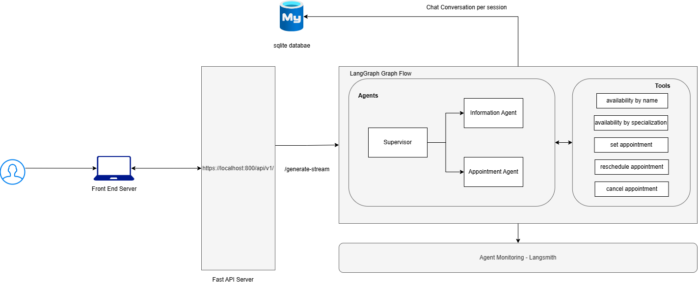
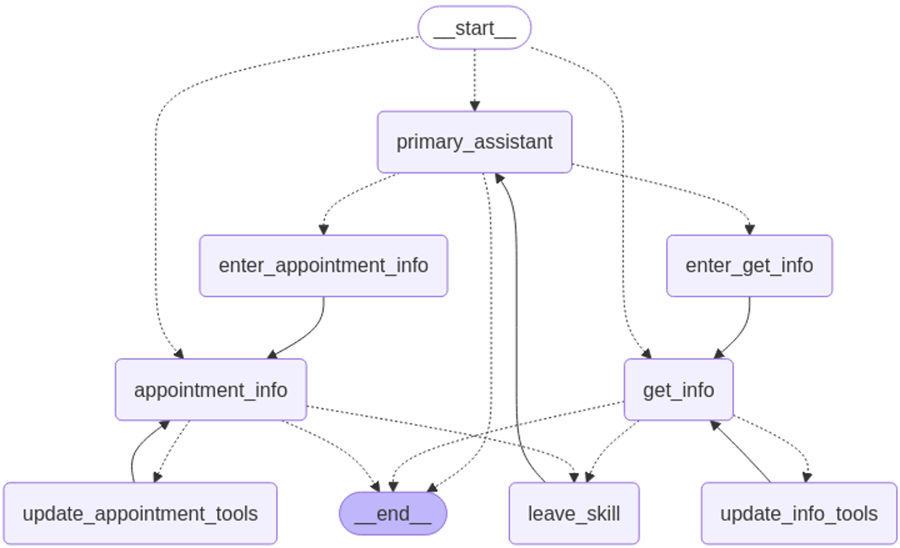

# Multi-Agent Appointment Booking System

This project implements a **multi-agent system** for appointment booking using **LangGraph**. The system allows users to interact in **natural language** to inquire about doctor availability, set, reschedule, or cancel appointments while maintaining conversational context.

## 🎥 Video Demo  
[](https://www.youtube.com/watch?v=ySkK4nvvNJE)  

Click the image above to watch the demo on YouTube.

## ✨ Key Features

- **Natural Language Interaction**: Users can ask about doctor availability and book/reschedule/cancel appointments.
- **Multi-Agent System**: Separate AI agents handle information retrieval, scheduling, and rescheduling.
- **Context Awareness**: The system maintains conversation context per session.
- **Efficient Query Handling**: Queries are efficiently processed using LangGraph and multiple AI agents.

## 🏗 Architecture

The system consists of:

- **Front-End Server**: Interacts with users.
- **FastAPI Backend**: Handles API requests at `/generate-stream`.
- **LangGraph Agents**:
  - **Supervisor Agent**: Coordinates tasks.
  - **Information Agent**: Retrieves doctor availability details.
  - **Appointment Agent**: Manages appointment scheduling, rescheduling, and cancellation.
- **SQLite Database**: Stores session-based chat conversations.
- **LangSmith Monitoring**: Observes agent activity and flow execution.



## 🔄 Multi-Agent Flow in LangGraph

The **LangGraph**-powered agentic workflow includes:

- **Primary Assistant**: Guides users through appointment-related tasks.
- **Appointment Agent**: Handles new appointment details.
- **Update Appointment Tools**: Tools to set, reschedule or cancel an appointment.
- **Information Agent**: Handle Availbility related query based on specialization or name.
- **Update Information Tools**: Tools to fetch doctor's availability.
- **Exit & Context Management**: Manages session flow and conversation termination.




## 🚀 Getting Started

### 1️⃣ Clone the Repository
```bash
git clone https://github.com/your-repo/Multi-Agent-Appointment-Booking.git
cd Multi-Agent-Appointment-Booking 
```

### 2️⃣ Install Dependencies
```bash
pip install -r requirements.txt
```

### 3️⃣ Start the FastAPI Server
```bash
uvicorn main:app --host 0.0.0.0 --port 8000 --workers 2 --reload
```

### 4️⃣ Start the Streamlit UI
```bash
streamlit run front-end/chat_ui.py
```


## 📌 Future Enhancements

- Extend AI capabilities for multi-specialty clinic bookings.
- Integrate additional external databases for real-time availability.
- Implement authentication and user management.
- Implement More Skills/tools and Agents

## 🛠 Tech Stack

- **FastAPI**: Backend API Framework
- **LangGraph**: Multi-Agent Workflow
- **SQLite**: Database
- **LangSmith**: Agent Monitoring
- **Uvicorn**: ASGI Server

## 📧 Contact

For issues or contributions, create a pull request or open an issue. 🚀  

Connect with me on **[LinkedIn (Anurag Mishra)](https://www.linkedin.com/in/anurag-mishra-660961b7/)**.
